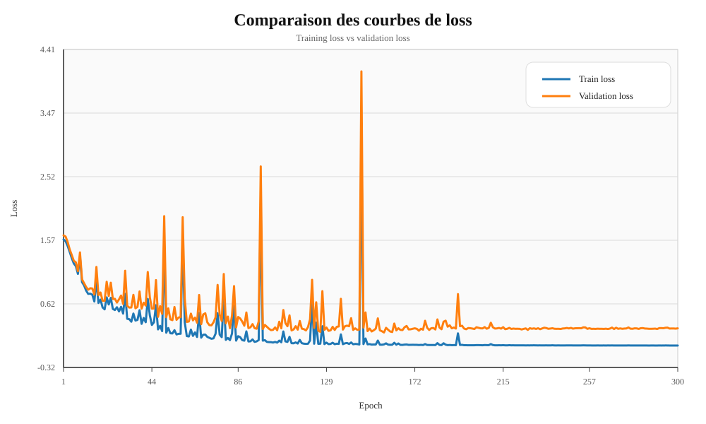
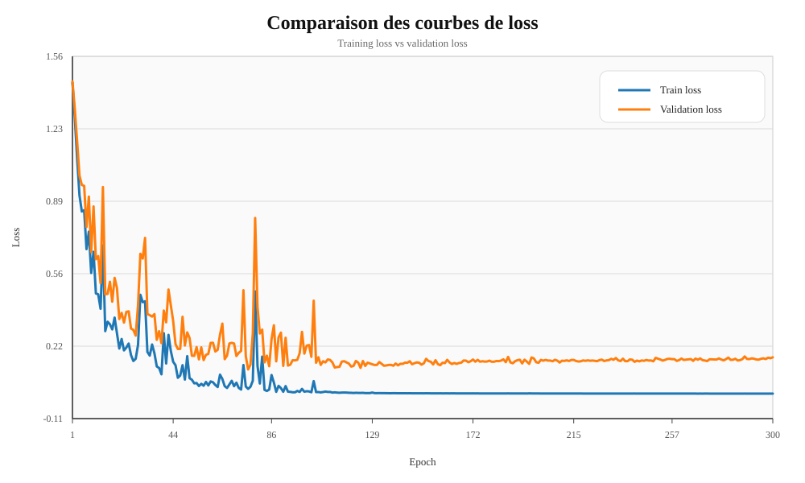
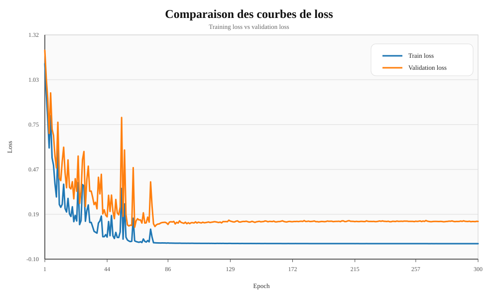

# Premier cas d'entrainement :

## Paramètres :
- INPUT_SIZE       = 256
- HIDDEN_SIZE      = 8
- OUTPUT_SIZE      = 5
- ACTIVATION       = relu
- LEARNING_RATE    = 0.01
- TRAIN_RATIO      = 0.70
- VALIDATION_RATIO = 0.15
- TEST_RATIO       = 0.15
- TARGET_ERROR     = 0.05

### Nombre d'epochs :
75

### Matrice de confusion :
| Vraie \ Prédite | happy | neutral | sad | angry | surprised |
| --- | ---: | ---: | ---: | ---: | ---: |
| happy | 15 | 0 | 0 | 0 | 0 |
| neutral | 1 | 13 | 1 | 0 | 0 |
| sad | 0 | 0 | 15 | 0 | 0 |
| angry | 1 | 0 | 0 | 14 | 0 |
| surprised | 0 | 0 | 0 | 0 | 15 |

Performance par classe:
 - happy : 
    - acc=100.00% 
    - precision=88.24% 
    - recall=100.00% 
    - F1=93.75%
 - neutral : 
    - acc=86.67% 
    - precision=100.00% 
    - recall=86.67% 
    - F1=92.86%
 - sad : 
    - acc=100.00% 
    - precision=93.75% 
    - recall=100.00% 
    - F1=96.77%
 - angry : 
    - acc=93.33% 
    - precision=100.00% 
    - recall=93.33% 
    - F1=96.55%
 - surprised : 
    - acc=100.00% 
    - precision=100.00% 
    - recall=100.00% 
    - F1=100.00%

Accuracy globale : 96.00%

Macro F1: 95.99%

### Interprétation :
- Le modèle est globalement très performant, avec une accuracy élevée et un macro F1 proche de l'accuracy, ce qui indique un comportement assez équilibré entre les classes.
- La classe `surprised` est la mieux reconnue ici, sans erreur sur l'échantillon de validation affiché.
- Les principales confusions concernent `neutral` et, dans une moindre mesure, `angry`, ce qui suggère que ces expressions partagent des caractéristiques visuelles proches dans le jeu de données.
- Les scores de precision et de recall restent élevés pour toutes les classes, donc le modèle ne semble pas déséquilibré sur une classe particulière.
- En pratique, les erreurs restantes sont ponctuelles et la matrice de confusion montre que le modèle généralise correctement sur ce premier entraînement.

# Modification du learning rate 

# Learning rate à 0.1 :
| Vraie \ Prédite | happy | neutral | sad | angry | surprised |
| --- | ---: | ---: | ---: | ---: | ---: |
| happy | 15 | 0 | 0 | 0 | 0 |
| neutral | 15 | 0 | 0 | 0 | 0 |
| sad | 15 | 0 | 0 | 0 | 0 |
| angry | 15 | 0 | 0 | 0 | 0 |
| surprised | 15 | 0 | 0 | 0 | 0 |

Performance par classe:
 - happy : 
    - acc=100.00% 
    - precision=20.00% 
    - recall=100.00% 
    - F1=93.33.33%
 - neutral : 
    - acc=0.00% 
    - precision=0.00% 
    - recall=0.00% 
    - F1=0.00%
 - sad : 
    - acc=0.00% 
    - precision=0.00% 
    - recall=0.00% 
    - F1=0.00%
 - angry : 
    - acc=0.00% 
    - precision=0.00% 
    - recall=0.00% 
    - F1=0.00%
 - surprised : 
    - acc=0.00% 
    - precision=0.00% 
    - recall=0.00% 
    - F1=0.00%

Accuracy globale : 20.00%

Macro F1: 6.67%

## Learning rate à 0.01 :
### Arrêt de la boucle au bout de 300 epochs

| Vraie \ Prédite | happy | neutral | sad | angry | surprised |
| --- | ---: | ---: | ---: | ---: | ---: |
| happy | 12 | 2 | 0 | 1 | 0 |
| neutral | 14 | 0 | 1 | 0 | 0 |
| sad | 0 | 0 | 15 | 0 | 0 |
| angry | 0 | 1 | 0 | 14 | 0 |
| surprised | 1 | 0 | 0 | 0 | 14 |

Performance par classe:
 - happy : 
    - acc=80.00% 
    - precision=92.31% 
    - recall=80.00% 
    - F1=93.85.71%
 - neutral : 
    - acc=93.33% 
    - precision=82.35% 
    - recall=93.33% 
    - F1=87.50%
 - sad : 
    - acc=100.00% 
    - precision=93.75% 
    - recall=100.00% 
    - F1=96.77%
 - angry : 
    - acc=93.33% 
    - precision=93.33% 
    - recall=93.33% 
    - F1=93.33%
 - surprised : 
    - acc=93.33% 
    - precision=100.00% 
    - recall=93.33% 
    - F1=96.55%

Accuracy globale : 92.00%

Macro F1: 91.97%

## Interprétation

- Premier entraînement (LR = 0.01, 75 epochs) : excellente performance globale (accuracy 96%, macro F1 95.99%). Le modèle est équilibré entre les classes, `surprised` et `sad` sont parfaitement reconnus ici. Les confusions restantes sont faibles et localisées (`neutral` ↔ `sad`, `angry` ↔ `happy`).

- Learning rate = 0.1 : effondrement du modèle vers une prédiction majoritaire (tout prédit `happy`). Symptôme d'un taux d'apprentissage trop élevé : le modèle s'enferme dans un classifieur. Cela donne une très haute recall pour `happy` mais des précisions nulles pour les autres classes.

- Learning rate = 0.01 (300 epochs) : performance dégradée par rapport au premier cas (accuracy 92%, macro F1 91.97%). Deux hypothèses plausibles :
   - surapprentissage / instabilité due à un training trop long sans early stopping (le modèle exploite le bruit) ;
   - oscillations d'entraînement conduisant à un minimum moins bon sur la validation que celui atteint au bout de 75 epochs.

# Retour à un learning rate de 0.01 pour les expériences sur la taille du modèle
## h = 4

### Matrice de confusion :
| Vraie \ Prédite | happy | neutral | sad | angry | surprised |
| --- | ---: | ---: | ---: | ---: | ---: |
| happy | 13 | 1 | 0 | 1 | 0 |
| neutral | 0 | 13 | 1 | 1 | 0 |
| sad | 0 | 0 | 15 | 0 | 0 |
| angry | 0 | 1 | 0 | 14 | 0 |
| surprised | 0 | 0 | 0 | 0 | 15 |

Performance par classe:
- happy :
   - acc=86.67%
   - precision=92.86%
   - recall=86.67%
   - F1=89.66%
- neutral :
   - acc=86.67%
   - precision=86.67%
   - recall=86.67%
   - F1=86.67%
- sad :
   - acc=100.00%
   - precision=93.75%
   - recall=100.00%
   - F1=96.77%
- angry :
   - acc=93.33%
   - precision=93.33%
   - recall=93.33%
   - F1=93.33%
- surprised :
   - acc=100.00%
   - precision=100.00%
   - recall=100.00%
   - F1=100.00%

Accuracy globale : 93.33%

Macro F1: 93.29%

### Courbes de loss :

### Interprétation :
- Les courbes de loss ne montrent pas de divergence nette entre l'entraînement et la validation, donc il n'y a pas d'indice fort d'overfitting.
- En revanche, la loss ne descend pas jusqu'à un niveau vraiment satisfaisant, ce qui suggère plutôt un problème de convergence ou un modèle encore trop limité.
- Les performances restent correctes, mais les erreurs sur `happy` et `neutral` indiquent que la capacité du réseau avec `h = 4` est probablement insuffisante pour séparer complètement toutes les classes.
- Ce résultat plaide davantage pour un ajustement de l'architecture ou de l'optimisation que pour une stratégie anti-overfitting.

## h = 16

### Matrice de confusion :
| Vraie \ Prédite | happy | neutral | sad | angry | surprised |
| --- | ---: | ---: | ---: | ---: | ---: |
| happy | 13 | 1 | 1 | 0 | 0 |
| neutral | 0 | 15 | 0 | 0 | 0 |
| sad | 0 | 0 | 15 | 0 | 0 |
| angry | 0 | 0 | 1 | 14 | 0 |
| surprised | 0 | 0 | 0 | 0 | 15 |

Performance par classe:
- happy :
   - acc=86.67%
   - precision=100.00%
   - recall=86.67%
   - F1=92.86%
- neutral :
   - acc=100.00%
   - precision=93.75%
   - recall=100.00%
   - F1=96.77%
- sad :
   - acc=100.00%
   - precision=88.24%
   - recall=100.00%
   - F1=93.75%
- angry :
   - acc=93.33%
   - precision=100.00%
   - recall=93.33%
   - F1=96.55%
- surprised :
   - acc=100.00%
   - precision=100.00%
   - recall=100.00%
   - F1=100.00%

Accuracy globale : 96.00%

Macro F1: 95.99%

### Courbes de loss :

### Interprétation :
- On obtient quasiment les mêmes résultats qu’avec `h = 8`, mais plus tôt dans l’entraînement, ce qui suggère que le modèle plus large apprend plus vite.
- Les performances sont globalement bonnes et restent stables, avec seulement quelques confusions ponctuelles sur `happy`, `sad` et `angry`.
- En revanche, on voit que sur les derniers epochs la courbe de loss remonte légèrement, ce qui indique que le meilleur point est atteint avant la fin de l’entraînement.
- En pratique, un early stopping permettrait probablement de conserver le meilleur compromis atteint plus tôt.

# h = 64

### Matrice de confusion :
| Vraie \ Prédite | happy | neutral | sad | angry | surprised |
| --- | ---: | ---: | ---: | ---: | ---: |
| happy | 14 | 0 | 1 | 0 | 0 |
| neutral | 1 | 14 | 0 | 0 | 0 |
| sad | 1 | 0 | 14 | 0 | 0 |
| angry | 1 | 0 | 0 | 14 | 0 |
| surprised | 0 | 0 | 0 | 0 | 15 |

Performance par classe:
- happy :
   - acc=93.33%
   - precision=87.50%
   - recall=93.33%
   - F1=90.32%
- neutral :
   - acc=93.33%
   - precision=93.33%
   - recall=93.33%
   - F1=93.33%
- sad :
   - acc=93.33%
   - precision=93.33%
   - recall=93.33%
   - F1=93.33%
- angry :
   - acc=93.33%
   - precision=100.00%
   - recall=93.33%
   - F1=96.55%
- surprised :
   - acc=100.00%
   - precision=100.00%
   - recall=100.00%
   - F1=100.00%

Accuracy globale : 94.67%

Macro F1: 94.71%

### Courbes de loss :

### Interprétation :
- Les performances pour `h = 64` sont bonnes (accuracy 94.7%, macro F1 94.7%) et comparables à `h = 8`/`h = 16`, avec des erreurs dispersées entre plusieurs classes.
- Le modèle semble apprendre rapidement et atteindre des performances stables, mais la courbe de loss (voir image) montre des fluctuations en fin d'entraînement — début d'instabilité ou léger sur-entraînement local.
- Contrairement à un overfitting marqué, il s'agit plutôt d'une remontée modérée de la loss sur les derniers epochs ; un early stopping permettrait de sauvegarder le meilleur checkpoint.

## Conclusion
On observe au bout d'un certain temps que la validation loss atteint son taux le plus bas et que dans les modèles les plus complexes, celle si stagne avant de légèrement remonter. Si on laissait l'entrainement tourner plus longtemps, on pourrait faire face à une situation d'overfitting nette.
Solution : tester early stopping, améliorer le dataset en incluant plus d'images variées, se concentrer sur les modèles moins complexes qui donnaient de meilleurs résultats et plus tôt

# Passage aux images couleur (PPM)
## Entrainement avec les meme paramètres initiaux
| Vraie \ Prédite | happy | neutral | sad | angry | surprised |
| --- | ---: | ---: | ---: | ---: | ---: |
| happy | 13 | 1 | 1 | 0 | 0 |
| neutral | 1 | 14 | 0 | 0 | 0 |
| sad | 0 | 1 | 14 | 0 | 0 |
| angry | 0 | 1 | 0 | 14 | 0 |
| surprised | 0 | 0 | 0 | 0 | 15 |

  Performance par classe:
- happy :
   - acc=86.67%
   - precision=89.47%
   - recall=85.00%
   - F1=87.18%
- neutral :
   - acc=93.33%
   - precision=82.61%
   - recall=95.00%
   - F1=88.37%
- sad :
   - acc=93.33%
   - precision=95.00%
   - recall=95.00%
   - F1=95.00%
- angry :
   - acc=93.33%
   - precision=100.00%
   - recall=90.00%
   - F1=94.74%
- surprised :
   - acc=100.00%
   - precision=100.00%
   - recall=100.00%
   - F1=100.00%

Accuracy globale: 93.00%

Macro F1: 93.06%

## Analyse comparative : PPM vs PGM

- **Bilan chiffré rapide :** PGM: `Accuracy=96.00%`, `Macro F1=95.99%`. PPM: `Accuracy=93.00%`, `Macro F1=93.06%`. Passage couleur → baisse d'environ 2.9–3.0 points absolus.

- **Comportement par classe :**
   - `happy` : forte baisse du recall (100% → 85%) et baisse du F1 (93.75 → 87.18). Le modèle confond davantage `happy` en couleur.
   - `neutral` : recall augmente (86.67% → 95%) mais precision chute (100% → 82.61%) — plus de faux positifs classés `neutral` en PPM.
   - `sad` / `surprised` : performances stables et élevées sur les deux représentations.
   - `angry` : globalement stable, légère variation du recall (≈93% → 90%).
